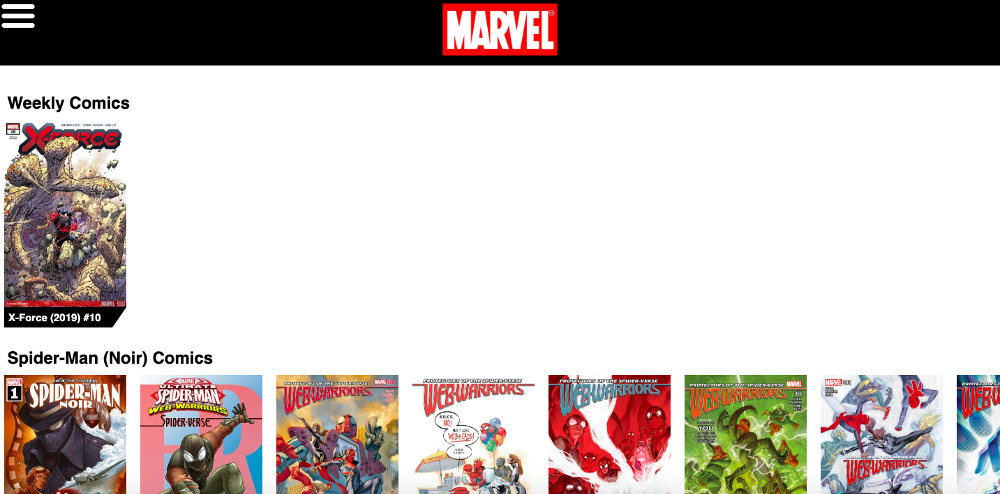
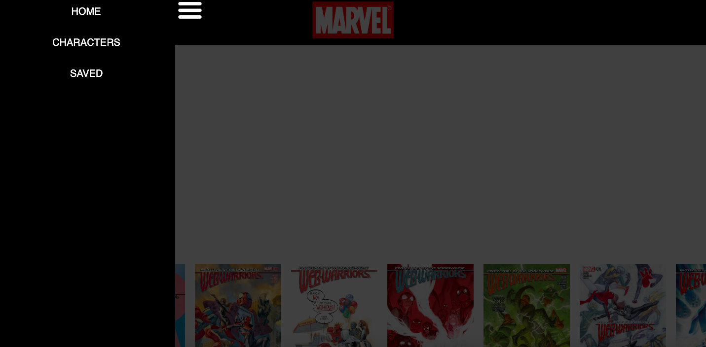
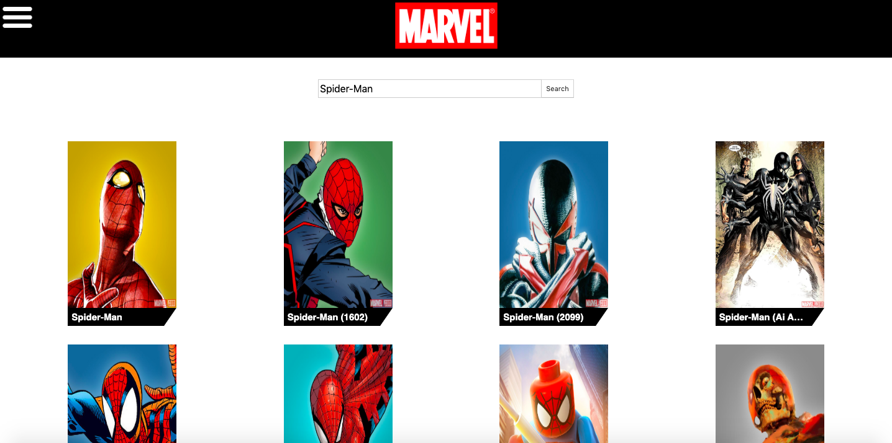
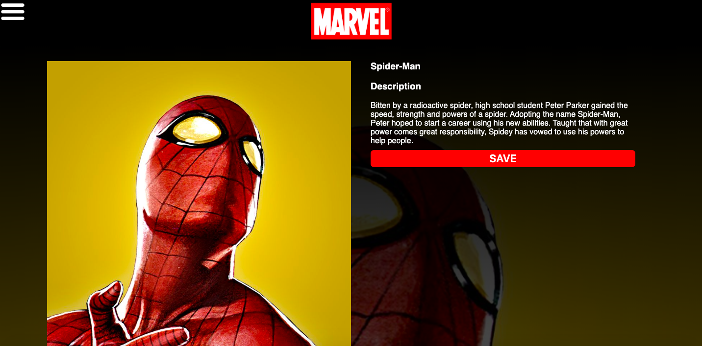
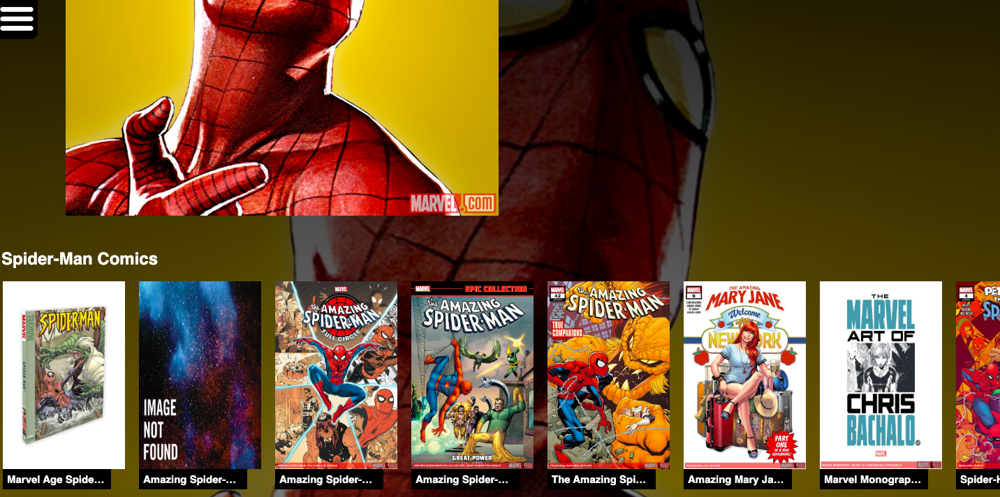
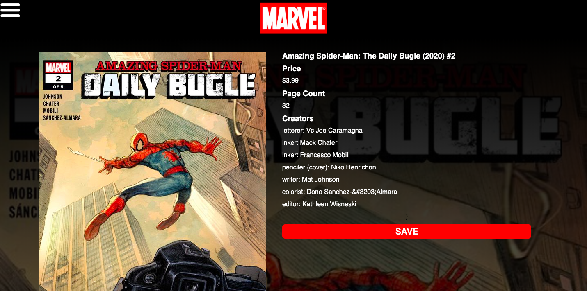
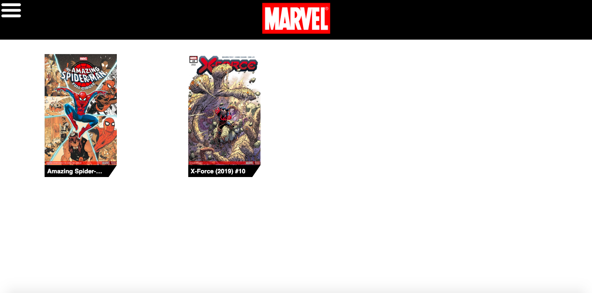

# Comic-Tracker

## Summary 

When I first became a software engineer I struggled with the idea of building an application around a topic I was passionate about, as well one that I could solve a simple problem with. As time went on, I finally found a problem I cared about: getting the current weeks comics.

So here's the thing it's already been done. Both Marvel and DC Comics have created mobile applications that list out their many comics and charcaters. However, that wasn't a reason to stop me from building this application. The main purpose of this application was for me to both build something that I was passionate about, and to challenge myself to solve a problem (regardless of whether it had already been solved).

So you may ask, "what actually is Comic-Tracker in it's current and working state?"

Comic-Tracker is peronally built web application with the main purpose of delivering both the current weeks comics, as well as the titular characers of them, to the user. The application's main and most important resource is the Marvel API, which it uses to grab data on the comics and characters. The the app also uses both React and Redux to handle a lot of that data, which is being passed around between components and pages.

Some other notable features of the application include:

- Being able to search for characters, as well as favoriting them, allowing you to see their featured comics on the home page.

- Clicking on presented comics displays information on how much it is and who worked on it.

- Being able to save specific comics so that you can refrence which ones to buy.

- Clicking on characters shows their information as well as featured comics.

## Preview

### Home Page





### Character Pages







### Comic Pages





## Setup

Important Note: Due to the fact that this is an exclusively front-end application, you'll need to sign up and acquire your own Marvel API keys at: https://developer.marvel.com/

Once you have your own api keys follow the instructions below.

1. Clone down the repository

2. Open repository in terminal and run `npm install`

3. Create a file named `apikeys.js` within the `API` directory in `src`

4. Within the `apikeys.js` file, type out the following code with your api keys:

```
export const PRIVATE_API_KEY = 'Your Api Key Here';

export const PUBLIC_API_KEY = 'Your Api Key Here';
```

5. Finally run `npm start` in terminal and open localhost:3000 in browser
